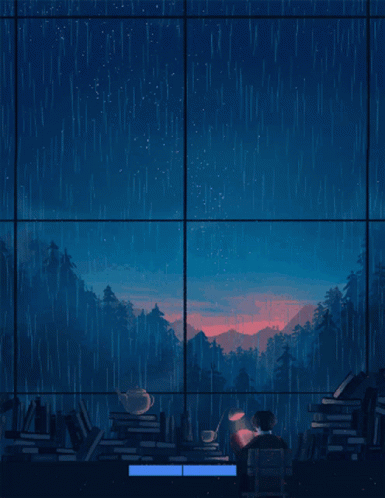

 
 

    
     
    
    

  

<h2 align="center"> Self-taught, curious, and passionate about coding!</h2>

* 🌳 I’m currently learning React !  
Actively Going through:
  - Big Data
  - Web Development Bootcamp
  - Udemy: Begineer to Advance React Course   

* 🐾 I’m looking to network!   

* 🌊 2023 Goals: Contribute more to Open Source projects   

* ☕ Interest: Chess, Coffee, and Coding.   

* :octocat: Hobbies: Reading, Games, Discord, and Reddit.   

<h2></h2> 

 
   

  <h2> <strong> In Stack </strong></h2>
     
  <h2> <strong> In Queue </strong></h2>
  

 
    

  <h2> <strong> My Github Stats </strong> </h2>

      

   <!-- 

    
  
 -->

    

  

  

  

<h3 align="center">Connect With Me</h3>

   &nbsp;&nbsp;
  
   &nbsp;&nbsp;
  
   &nbsp;&nbsp;

  <a>
       <a href="https://discord.gg/H4ewukTpg" target="_blank">
    
    Achiyant#80205
      </a>

 
